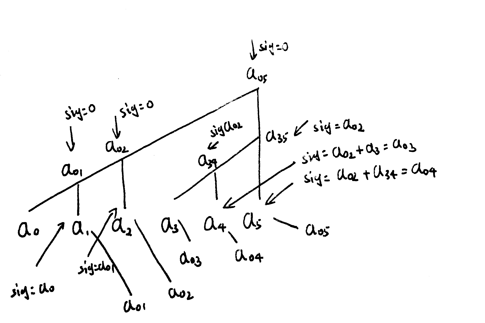

# Lecture 02

## The Prefix sum problem

See also: [http://en.wikipedia.org/wiki/Prefix_sum](http://en.wikipedia.org/wiki/Prefix_sum)

## Prefix Sum

### processors = n

假设我们有个数列：1, 2, 3, 4, 5, 6
其 prefix sum 数列应为：1, 3, 6, 10, 15, 21

迭代算法见下：

第 N 代 | $a_0$ | $a_1$ | $a_2$ | $a_3$ | $a_4$ | $a_5$ |
-|-|-|-|-|-|-|-|-
0（原始数列） | 1 | 2          | 3         | 4          | 5            | 6
1（前两项和） | 1 | 1+2=3      | 2+3=5     | 3+4=7      | 4+5=9        | 5+6=11
2（前四项和） | 1 | 0\*2+3=3   | 0+1+5=6   | 3+7=10     | 5+9=14       | 7+11=18
3（前八项和） | 1 | 0\*6+3=3   | 0\*5+6=6  | 0\*4+10=10 | 0\*3+1+14=15 | 3+18=21


该算法需要 $n$ 个 processors，然后时间复杂度为 $O(\log{n})$

注：对于位数不满足的情况，在前面 padding 0 就好了

### processors < n

假设我们有 $p$ 个处理器，其中 $p<n$
我们首先将 $n$ 个数分为 $p$ 个组
对于每一个组，我们使用一个处理器通过串行朴素算法进行计算其组内前缀和数组 $s[g, i]$，
这一步的时间复杂度为 $O(\frac{n}{p})$
我们注意到，每一个组的数的和就是其最后一个元素的前缀和
我们得到了 $p$ 个组的和，并且有 $p$ 个处理器可以用于操作。
于是我们可以使用前文提到的算法算出组间的前缀和 $S[g]$，这一步的时间复杂度为 $O(\log p)$。
最后我们更新每一个数的部分和：
$$result[g, i] = s[g, i] + S[g-1]$$
这一步的时间复杂度为 $O(\frac{n}{p})$

故其总体的时间复杂度为 $O(\frac{n}{p}+\log p)$ ，达到了其时间复杂度下限，即summation的复杂度

注：因为对于数列的最后一个数，其 prefix sum 的值即为数列的 sum，
所以 prefix sum 的时间复杂度下限即为 sum 运算。

## Prefix Problem and Binary Tree

每一个节点都会收到一个信号值，
该节点将该信号值传递给左叶子，
然后将左叶子的值与信号值的和传递给右叶子。
当信号传递到底部的时候就可以得到预期的 $a_{0k}$ 了。



此外，可以观察到的是，这棵树的横向尺度表达了其需要的 processors，
而其纵向尺度则表达了其需要的时间。

注：$a_{ij}$ 表示从 $index = i$ 加到 $index = j$。

## Prefix Minimum

大概有这样几种思路：

- 算法一：对于每前 $i$ 个数，使用 $i^2$ 个核，在 $O(1)$ 的时间复杂度内算出其最小值，处理器复杂度为：
$$O(\sum_{i=1}^n{i^2})=O(n^3)$$

- 算法二：

    - 分成 $n^{1/2}$ 组，每组有 $n^{1/2}$ 个数，每组使用算法一进行计算，处理器复杂度为： $$O(n^{1/2}*(n^{1/2})^3)=O(n^2)$$

    - 然后对这 $n^{1/2}$ 个组的最小值计算前缀最小值，处理器复杂度为：
$$(n^{1/2})^3=n^{1.5}$$

    - 最后使用 $n$ 个处理器对于每一个数的组内前缀和与组间前缀和中取较小值。

    - 总处理器复杂度为$O(n^2)$，时间复杂度为 $O(1)$

- 算法三：（思考题）

    - 首先确保时间复杂度为 $O(1)$

    - 改进算法二：

        - 分成 $g$ 组，第一步的处理器复杂度为 $O(g*(n/g)^3)=O(n^3/g^2)$

        - 第二步的处理器复杂度为 $O(g^3)$

        - 第三步的处理器复杂度仍为 $O(n)$

    - 显然，当前两步使用处理器数量相同时，总处理器需要最少，故有：
$$n^3/g^2=g^3$$

    - 故当 $g=n^{0.6}$ 时，处理器复杂度为 $O(n^{1.8})$ ，这是一轮分组前缀最小值的最优情况。

    - 然而如果我们在算法一种采取一轮分组算法来进行组内最小值计算，由于一轮分组的最小值算法的处理器复杂度为 $O(n^{4/3})$ ，所以算法一的处理器复杂度改变为 $O(n^{7/3})$ 。如果使用这个算法来进行最优化分组的一轮分组前缀最小值算法的第一步与第二步，那么最终的最小处理器复杂度为 $O(n^{11/7})$

    - 所以说这里推到得到的算法很可能并不是最优的，因为按照这种思路可以持续进行优化，但时间复杂度有可能会提升，这不是我们想要的情况。

- 上课没有提到的情况：约束 $p=n$

- 上课没有提到的情况：约束 $p<n$

    - 可能通过分组单核处理，然后通过 $p=n$ 的算法解出


## Parallel Sorting

1. Bucket Sorting

    对于 $n$ 个 numbers，我们把它分成 $\frac{n}{p}$ 组，每组有 $p$ 个。
    然后我们准备 types(数的种类数，这里我们假设为 $\frac{n}{p}$ 种) 个桶，对于每个桶我们准备 $p$ 个槽。
    所以对于某个处理器#$i$正在处理的数 $x$，我们首先基于 $x$ 找到其对应的桶，
    然后根据处理器的序号 $i$ 找到对应的槽，放入。

    每个槽存的其实是 count 和指针。

2. Prefix Summing

    有了 count 之后我们做 prefix sum 就能得到其 index 范围。

3. Create Array

    在上一步中，我们得到了（一共 $n$ 条）：
    ```javascript
    [
        { bucket: 0, slot: 0, index: 2}，
        { bucket: 0, slot: 1, index: 5},
        { bucket: 1, slot: 0, index: 9},
        { bucket: 1, slot: 1, index: 12},
        ...
    ]
    ```

     然后我们将所有每一条数据交给 processor 去做，如对第一条数据我们知道 index 为 2，
     然后我们查之前的 count 数组里的数据，查到 count 为 2。
     这样我们就知道 arr[0] 和 arr[1] 都应该是 0。

     注：slot#n 应交给 processor#n，这样保证了每个 processor 不会有超过 $\frac{n}{p}$ 个数要处理。

## Summary

### Sum

$T_1=O(n)$

$T_p=O(\frac{n}{p}+\log{p})$

### Min

$T_1=O(n)$

$T_p=O(\frac{n}{p}+\log\log{n})$

### Interger Sorting

$T_1=O(n)$

Expecting (Randomize 算法可以实现，但是有时候会有 error):
$$
T_p=O(\frac{n}{p}+\log n)
$$

#### Why $\frac{n}{p}+\log{n}=\frac{n}{p}+\log{p}$ ?

当 $n$ 远大于 $p$ 时，此时由于 $\log{n}$ 为小项，故消去，两式相等。

当 $p$ 较大时，由于实际只有 n 需要操作，所以两项还是相等。

See also: [#5](https://github.com/zenozeng/parallel-algorithm-notes/issues/5)

#### CRCW

Any range: $\frac{n\log\log n}{p}+\log{n}$

{0, 1, ..., $n^k$}: $\frac{n\log\log n}{p}$

#### EREW

$n\frac{\sqrt{\log n}}{p}+\log{n}$
