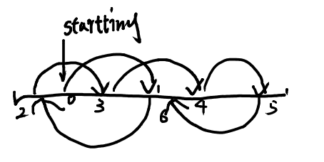

# Lecture 03

## 引子



如图，现在假设我们有一个存在 array 中的链表，
然后我们需要将其依序存在 array 中（就是把这个链表弄弄直）。

在线性算法中，我们需要 $O(n)$ 的时间来完成这个需求。
现在我们需要并行地完成它，
你会马上想到利用我们前面学过的建树来解决这个问题，
但是如果对每个元素直接建树，你会发现每次只能缩减一个（如下图）。
这不是我们想要的。


## 链表建树

在之前的课中，我们利用二分的策略来完成我们的建树工作，而在链表中，相似的，
我们引入 pointer jumping 的概念：

```javascript
A[i].next = A[i].next.next;
```


先看第一层，我们首先找到当前一个链表中的最大无关集（图中画了下滑线的点，后文我们会描述相关算法）。
找到最大无关集后我们对其和其 next 节点进行建树，由于是无关集，
所以保证了不会发生上面那个坏树的情况。
从第一层到第二层，我们可以发现相邻两个节点被合并，
而孤节点则直接被拉上来（通过 pointer jumping）。
这个过程我们称为 symmetry breaking。
重复这个过程，我们就能建出一颗树。

注：由于是直接取指针，不是赋值，所以不要担心层迭代时的性能。

注2：

- __maximal independent set__: could not add one more point

- __maximum independent set__: number is max

如：

[$a_0$, $\underline{a_1}$, $a_2$, $\underline{a_3}$, $a_4$] 是一个 maximal independent set，因为不能再加入任意一个点了，但它在数值上不是最大的。
maximum independent set 应该是 [$\underline{a_0}$, $a_1$, $\underline{a_2}$, $a_3$, $\underline{a_4}$]

这里我们讨论的都是 maximal 的情况，因为 maximum 往往并不好找。

## 寻找链表中最大无关集

### 当我们有个染好色的链表

现在假设我们有一个染好色的链表，一共三种颜色，
而且我们保证了相邻两个节点不会有相同的颜色：

<script type="text/x-mathjax-config">
  MathJax.Hub.Config({ TeX: { extensions: ["color.js"] }});
</script>

[$\color{red} a_0$, $\color{green} a_1$, $\color{red} a_2$, $\color{blue} a_3$, $\color{red} a_4$, $\color{green} a_5$, $\color{blue} a_6$]

然后我们从里面取一个颜色，比如红色，就能取到一个无关集。

[$\color{red} \underline{a_0}$, $\color{green} a_1$, $\color{red} \underline{a_2}$, $\color{blue} a_3$, $\color{red} \underline{a_4}$, $\color{green} a_5$, $\color{blue} a_6$]

然后我们在对蓝色的每一个元素做检查，如果其相邻元素不在当前的 set 中，就插入。
这样我们就可以得到一个最大无关集。

[$\color{red} \underline{a_0}$, $\color{green} a_1$, $\color{red} \underline{a_2}$, $\color{blue} a_3$, $\color{red} \underline{a_4}$, $\color{green} a_5$, $\color{blue} \underline{a_6}$]

### 那么如何染色呢？
